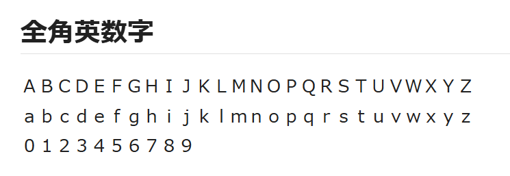
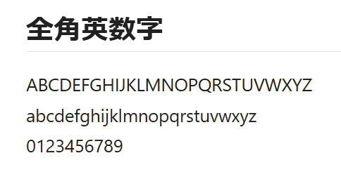

# Zen2Han


## 概要

**Zen2Han**は、ウェブページ内の全角英数字と記号を半角に自動変換する Chrome 拡張機能です。日本語サイトで使用される全角文字（ＡＢＣ、１２３、＠＃＄など）を読みやすい半角文字に変換します。

## 機能

- **自動変換**: ページ読み込み時に全角英数字・記号を自動的に半角に変換
- **動的対応**: Ajax などで動的に追加されるコンテンツも自動変換
- **切替機能**: ツールバーアイコンから簡単に変換機能の ON/OFF を切り替え可能
- **設定記憶**: 有効/無効の設定はブラウザを閉じても記憶されます

## 変換対象文字

- 全角アルファベット（ＡＢＣ～ＸＹＺ、ａｂｃ～ｘｙｚ）
- 全角数字（０１２３４５６７８９）
- 全角記号（！＂＃＄％＆＇（）＊＋，－．／：；＜＝＞？＠［＼］＾＿｀｛｜｝～）
- 全角スペース

## インストール方法

### 開発モードでのインストール

1. このリポジトリをクローンまたはダウンロード
   ```
   git clone https://github.com/ueponx/zen2han.git
   ```
2. Chrome ブラウザで `chrome://extensions` を開く
3. 右上の「デベロッパーモード」をオンにする
4. 「パッケージ化されていない拡張機能を読み込む」をクリックし、ダウンロードしたフォルダを選択

## 使い方

1. インストール後、自動的に全てのウェブページで機能します
2. 変換を一時的に無効にするには、ツールバーのアイコンをクリックし、トグルスイッチをオフにします
3. 再度有効にするには、トグルスイッチをオンに戻します

## スクリーンショット





*変換前と変換後の比較例*

## 技術スタック

- JavaScript ES6
- Chrome Extension API
- HTML5 / CSS3

## ディレクトリ構造

```
Zen2Han/
├── manifest.json    # 拡張機能設定ファイル
├── content.js       # 変換処理スクリプト
├── background.js    # バックグラウンドスクリプト
├── popup.html       # ポップアップUI
├── popup.js         # ポップアップスクリプト
└── images/          # アイコンなどの画像ファイル
    ├── icon16.png
    ├── icon48.png
    └── icon128.png
```

## ライセンス

MIT License - 詳細は [LICENSE](LICENSE) ファイルを参照してください

## 謝辞

- この拡張機能は多くのオープンソースプロジェクトに支えられています
- アイコンの素材は[こちら](https://fonts.google.com/icons)を使用しています。
